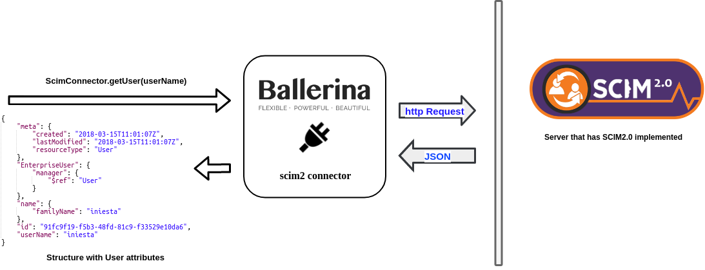

# SCIM2 Connector
 
 Connects to SCIM2 API from Ballerina.
 
 SCIM2 Connector provides an optimized way to use SCIM2 REST API from your Ballerina programs.
 It provides user management by allowing to create, delete, read, update users and groups, and manage 
 user's groups. It handles OAuth 2.0 and provides auto completion and type conversions.

 ## Compatibility
 | Ballerina Language Version| SCIM API Version                                          |
 | :------------------------:| :--------------------------------------------------------:|
 | 0.970.0-rc1               | [SCIM2.0](https://tools.ietf.org/html/rfc7643#section-8.3)|

 

 ## Getting Started
  1. Refer https://ballerina.io/learn/getting-started/ to download Ballerina and install tools.
  2. To use SCIM2 endpoint, you need to provide the following:
      - Client Id
      - Client Secret
      - Access Token
      - Refresh Token
      - Refresh Url
     
     *Please note that, providing ClientId, Client Secret, Refresh Token are optional if you are only providing a valid 
      Access Token vise versa.*
      
   3. Create a new Ballerina project by executing the following command.
   
        `<PROJECT_ROOT_DIRECTORY>$ ballerina init`
   	
 4. Import the scim2 package to your Ballerina program as follows.
    
    ```ballerina
    import ballerina/io;
    import wso2/scim2;
    
    endpoint scim2:Client scimEP {
        baseUrl:"https://localhost:9443",
	    clientConfig:{
		auth:{
		    scheme:"oauth",
		    accessToken:accessToken,
		    clientId:clientId,
		    clientSecret:clientSecret,
		    refreshToken:refreshToken,
		    refreshUrl:refreshUrl
		},
		url:url,
		secureSocket:{
		    trustStore:{
		        path:keystore,
		        password:password
		    }
		}
	    }
    };
    
    string message;
    string userName = "iniesta";
    var response = scimEP -> getUserByUsername(userName);
    match response {
        User usr => message = usr.userName;
        error er => message = er.message;
    }
    io:println(message);
    ```
